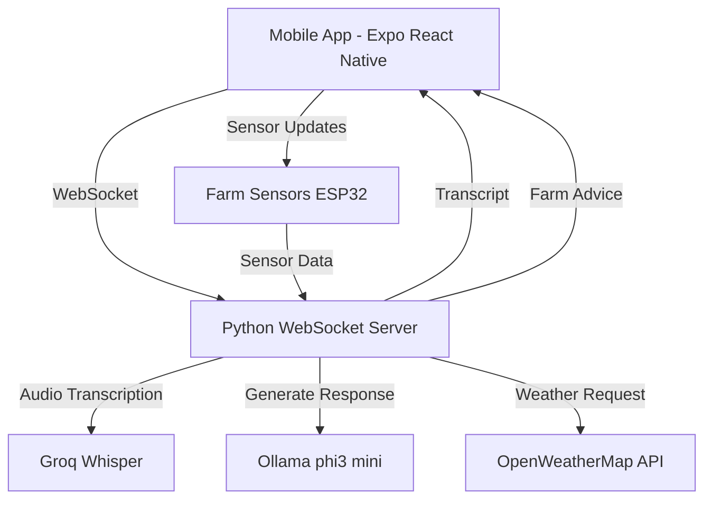
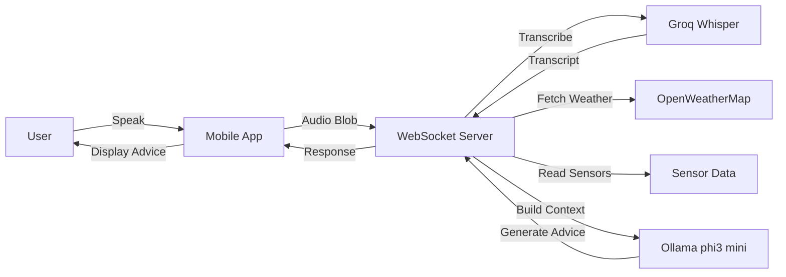

# FarmVoice (FarmVoice_v2)

FarmVoice is an Expo mobile app + a Python WebSocket voice server that helps farmers get short, actionable advice using:
- **Voice transcription (STT)** via **Groq Whisper**
- **Local AI responses** via **Ollama** (`phi3:mini`)
- **Live context** from **OpenWeatherMap** + latest sensor values received over WebSocket

---

## Architecture





---

## Key components

### Mobile app (Expo)
- Location: `app/`
- Stack: Expo + React Native + expo-router

### Voice/AI server (Python)
- Location: `server/app.py`
- Transport: WebSocket on **port 8765**
- Responsibilities:
  1. Receive audio and sensor updates
  2. Transcribe audio with **Groq Whisper**
  3. Generate farm advice with **Ollama** using weather + sensors
  4. Respond back to the client

---

## WebSocket message protocol

### Client → Server
- **`SENSOR_DATA`**
  - Example payload:
    ```json
    {
      "type": "SENSOR_DATA",
      "data": {
        "temperature": "26.5",
        "humidity": "61",
        "soil_moisture": "34"
      }
    }
    ```
- **`AUDIO_BLOB`**
  - Example payload:
    ```json
    {
      "type": "AUDIO_BLOB",
      "audio": "<base64 wav bytes>"
    }
    ```

### Server → Client
- **`TRANSCRIPT`** (sent after STT)
  ```json
  { "type": "TRANSCRIPT", "text": "..." }
  ```
- **`RESPONSE`** (sent after Ollama response)
  ```json
  { "type": "RESPONSE", "text": "..." }
  ```

---

## Configuration (.env)

### Backend environment variables
Create `server/.env` with (minimum):

```env
GROQ_API_KEY=your_groq_key
OPENWEATHER_API_KEY=your_openweather_key
CITY_NAME=Pune
```

Notes:
- If `GROQ_API_KEY` is missing, the server will warn and transcription will fail.
- `OLLAMA_MODEL` is currently hard-coded in `server/app.py` to `phi3:mini`.

---

## Setup & run

### 1) Start the backend (Python)
1. Install dependencies:
   ```bash
   pip install -r server/requirements.txt
   ```
2. Run the server:
   ```bash
   python server/app.py
   ```
3. Expected output:
   - `Voice Server running on ws://0.0.0.0:8765`

### 2) Start the mobile app (Expo)
1. Install frontend dependencies:
   ```bash
   npm install
   ```
2. Start Expo:
   ```bash
   npx expo start
   ```
3. Run on Android/iOS emulator or Expo Go.

---

## Project structure
- `app/` — Expo app routes and UI
- `components/` — shared UI components
- `constants/` — theme/config constants
- `hooks/` — custom React hooks
- `server/` — WebSocket voice server
  - `app.py` — main server
  - `list_models.py` — helper to list Groq models (if used)

---

## License

(Add your license here if needed.)

